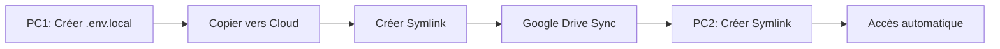

# 🔐 Gestion Sécurisée des Variables d'Environnement

*Solution Google Drive/OneDrive + Symlink pour sync multi-devices*

---

## 📋 Table des Matières

1. [Le Problème](#le-problème)
2. [La Solution](#la-solution)
3. [Comment Ça Fonctionne](#comment-ça-fonctionne)
4. [Setup Windows](#setup-windows)
5. [Setup Mac](#setup-mac)
6. [Setup Linux](#setup-linux)
7. [Vérification](#vérification)
8. [Troubleshooting](#troubleshooting)
9. [Sécurité](#sécurité)
10. [Alternative](#alternative-script-de-copie)

---

## 🎯 Le Problème

Le fichier `.env.local` contient des **secrets** (clés API Supabase, Anthropic, Stripe, etc.) qui :

❌ **Ne doivent JAMAIS être commités** dans Git (risque de fuite)
✅ **Doivent être synchronisés** sur plusieurs machines (laptop, PC fixe, etc.)

**Dilemme** : Comment synchroniser sans compromettre la sécurité ?

---

## 💡 La Solution

**Google Drive/OneDrive + Symlink (Lien Symbolique)**

### Concept Simple

```
📁 Google Drive/OneDrive (cloud sync automatique)
   └── Dev/
       └── paprika-secrets/
           └── .env.local  ← Fichier réel (sync automatiquement)

📁 C:\Repositories\Paprika\
   └── .env.local  ← Symlink (pointeur vers le fichier cloud)
```

**Résultat** : Un seul fichier réel dans le cloud, accessible via symlink dans ton projet.

### Avantages ✅

- ✅ **Zéro dépendance externe** - Tu as déjà Google Drive/OneDrive installé
- ✅ **Sync automatique instantané** - Modification sur PC1 → dispo sur PC2 immédiatement
- ✅ **Simple** - Setup une fois, oublié ensuite
- ✅ **Backup automatique** - Le cloud garde l'historique
- ✅ **Gratuit** - Pas de service payant
- ✅ **Cross-platform** - Fonctionne Windows/Mac/Linux

### Inconvénients ⚠️

- ⚠️ Secrets en clair dans le cloud (mais chiffré au repos par Google/Microsoft)
- ⚠️ Nécessite droits Admin pour créer symlink (Windows uniquement)
- ⚠️ Symlink peut casser si tu déplaces le dossier cloud

---

## 🔍 Comment Ça Fonctionne

### Qu'est-ce qu'un Symlink ?

Un **lien symbolique** (symlink) est un **pointeur** vers un autre fichier.

```
Fichier normal :
.env.local  →  [Contenu réel stocké ici]

Symlink :
.env.local  →  [Pointe vers] → Google Drive/.../env.local  →  [Contenu réel]
```

**Avantage** : L'application lit `.env.local` normalement, mais le contenu vient du cloud.

### Workflow

1. **Setup initial** (une fois) :
   - Créer dossier `paprika-secrets/` dans Google Drive
   - Copier `.env.local` dedans
   - Créer symlink dans le projet

2. **Utilisation quotidienne** :
   - Tu modifies `.env.local` (via symlink)
   - Google Drive sync automatiquement
   - Sur autre PC : modifications apparaissent automatiquement

3. **Nouveau PC** :
   - Installer Google Drive / OneDrive
   - Attendre sync
   - Créer symlink (même commande)
   - C'est tout ! ✅

---

## 🪟 Setup Windows

### Prérequis

- Google Drive ou OneDrive installé et synchronisé
- PowerShell avec droits **Administrateur**

### Étape 1 : Déterminer le Chemin Cloud

**Google Drive** :
```powershell
$cloudPath = "$env:USERPROFILE\Google Drive\My Drive"
# ou
$cloudPath = "G:\My Drive"  # Si monté comme lecteur
```

**OneDrive** :
```powershell
$cloudPath = "$env:USERPROFILE\OneDrive"
```

### Étape 2 : Créer le Dossier Secrets

```powershell
# PowerShell (pas besoin d'Admin pour cette étape)

# Pour Google Drive
mkdir "$env:USERPROFILE\Google Drive\My Drive\Dev\paprika-secrets"

# Pour OneDrive
mkdir "$env:USERPROFILE\OneDrive\Dev\paprika-secrets"
```

### Étape 3 : Copier .env.local

```powershell
# Aller dans le projet
cd C:\Repositories\Paprika

# Copier le fichier vers le cloud
# Google Drive :
cp .env.local "$env:USERPROFILE\Google Drive\My Drive\Dev\paprika-secrets\.env.local"

# OneDrive :
cp .env.local "$env:USERPROFILE\OneDrive\Dev\paprika-secrets\.env.local"
```

### Étape 4 : Créer le Symlink

**⚠️ IMPORTANT : PowerShell en mode Administrateur requis**

```powershell
# 1. Fermer PowerShell normal
# 2. Ouvrir PowerShell en tant qu'Administrateur (clic droit → "Exécuter en tant qu'administrateur")

# Aller dans le projet
cd C:\Repositories\Paprika

# Supprimer l'ancien .env.local
Remove-Item .env.local

# Créer le symlink

# Google Drive :
New-Item -ItemType SymbolicLink -Path ".env.local" -Target "$env:USERPROFILE\Google Drive\My Drive\Dev\paprika-secrets\.env.local"

# OneDrive :
New-Item -ItemType SymbolicLink -Path ".env.local" -Target "$env:USERPROFILE\OneDrive\Dev\paprika-secrets\.env.local"
```

**Résultat attendu** :
```
    Répertoire : C:\Repositories\Paprika

Mode                 LastWriteTime         Length Name
----                 -------------         ------ ----
l----         17/11/2025    10:30                .env.local -> C:\Users\...\OneDrive\...\env.local
```

Le `l----` au début confirme que c'est un symlink ! ✅

### Étape 5 : Sur un Autre PC

```powershell
# 1. Installer Google Drive / OneDrive
# 2. Se connecter avec le même compte
# 3. Attendre que le dossier Dev/paprika-secrets/ se synchronise

# 4. Cloner le projet (si pas déjà fait)
git clone <repo-url> C:\Repositories\Paprika
cd C:\Repositories\Paprika

# 5. Créer le symlink (PowerShell Admin)
# Google Drive :
New-Item -ItemType SymbolicLink -Path ".env.local" -Target "$env:USERPROFILE\Google Drive\My Drive\Dev\paprika-secrets\.env.local"

# OneDrive :
New-Item -ItemType SymbolicLink -Path ".env.local" -Target "$env:USERPROFILE\OneDrive\Dev\paprika-secrets\.env.local"

# 6. Vérifier que ça fonctionne
cat .env.local  # Doit afficher le contenu
```

---

## 🍎 Setup Mac

### Prérequis

- Google Drive (Google Drive for Desktop) ou OneDrive installé
- Terminal

### Setup Complet

```bash
# 1. Créer dossier secrets
mkdir -p ~/Library/CloudStorage/GoogleDrive-ton@email.com/My\ Drive/Dev/paprika-secrets

# Ou pour OneDrive :
mkdir -p ~/OneDrive/Dev/paprika-secrets

# 2. Copier .env.local
cd ~/Repositories/Paprika

# Google Drive :
cp .env.local ~/Library/CloudStorage/GoogleDrive-ton@email.com/My\ Drive/Dev/paprika-secrets/.env.local

# OneDrive :
cp .env.local ~/OneDrive/Dev/paprika-secrets/.env.local

# 3. Créer symlink (pas besoin de sudo sur Mac)
rm .env.local

# Google Drive :
ln -s ~/Library/CloudStorage/GoogleDrive-ton@email.com/My\ Drive/Dev/paprika-secrets/.env.local .env.local

# OneDrive :
ln -s ~/OneDrive/Dev/paprika-secrets/.env.local .env.local

# 4. Vérifier
ls -la .env.local
# Résultat : .env.local -> /Users/.../OneDrive/.../env.local

cat .env.local  # Doit afficher le contenu
```

---

## 🐧 Setup Linux

### Prérequis

- `rclone` pour sync Google Drive (ou OneDrive)

### Setup avec rclone

```bash
# 1. Installer rclone
curl https://rclone.org/install.sh | sudo bash

# 2. Configurer Google Drive
rclone config
# Suivre les instructions pour ajouter Google Drive

# 3. Monter Google Drive
mkdir -p ~/GoogleDrive
rclone mount gdrive: ~/GoogleDrive --daemon

# 4. Créer dossier secrets
mkdir -p ~/GoogleDrive/Dev/paprika-secrets

# 5. Copier .env.local
cd ~/Repositories/Paprika
cp .env.local ~/GoogleDrive/Dev/paprika-secrets/.env.local

# 6. Créer symlink
rm .env.local
ln -s ~/GoogleDrive/Dev/paprika-secrets/.env.local .env.local

# 7. Vérifier
ls -la .env.local
cat .env.local
```

---

## ✅ Vérification

### Test 1 : Le Symlink Fonctionne

```powershell
# Windows (PowerShell)
Get-Item .env.local | Select-Object LinkType, Target

# Mac/Linux
ls -la .env.local
```

**Attendu** : Doit afficher le chemin cible (Google Drive/OneDrive)

### Test 2 : Le Contenu est Accessible

```bash
cat .env.local
```

**Attendu** : Doit afficher le contenu de tes variables d'environnement

### Test 3 : Les Modifications se Synchronisent

1. **PC1** : Modifier `.env.local` (ajouter une ligne test)
   ```bash
   echo "TEST_VAR=hello" >> .env.local
   ```

2. **Attendre 10-30 secondes** (sync cloud)

3. **PC2** : Vérifier que la modification apparaît
   ```bash
   cat .env.local | grep TEST_VAR
   ```

**Attendu** : La ligne `TEST_VAR=hello` doit apparaître sur PC2

### Test 4 : L'Application Lit les Variables

```bash
npm start
```

**Attendu** : L'application démarre sans erreur de variables manquantes

---

## 🐛 Troubleshooting

### Erreur : "You do not have sufficient privilege to perform this operation"

**Cause** : Pas de droits Admin sur Windows

**Solution** :
```powershell
# Fermer PowerShell actuel
# Clic droit sur PowerShell → "Exécuter en tant qu'administrateur"
# Relancer la commande New-Item
```

---

### Erreur : Le symlink pointe vers un chemin qui n'existe pas

**Cause** : Le dossier Google Drive n'est pas encore synchronisé

**Solution** :
```powershell
# Vérifier si le dossier existe
Test-Path "$env:USERPROFILE\OneDrive\Dev\paprika-secrets\.env.local"

# Si False → Attendre la synchronisation du cloud
# Ouvrir Google Drive / OneDrive et vérifier le statut de sync
```

---

### Le contenu ne se synchronise pas entre PCs

**Diagnostic** :
```powershell
# Vérifier que le fichier réel est dans le cloud
cd "$env:USERPROFILE\OneDrive\Dev\paprika-secrets"
ls

# Vérifier le statut de sync OneDrive
# Clic droit sur l'icône OneDrive (barre des tâches) → Paramètres → État
```

**Solutions** :
- Vérifier connexion internet
- Vérifier espace disponible dans le cloud
- Forcer sync manuel (OneDrive → Paramètres → Synchroniser maintenant)

---

### Le symlink s'est cassé après avoir déplacé le projet

**Cause** : Symlink absolu, pas relatif

**Solution** : Recréer le symlink
```powershell
cd C:\Repositories\Paprika
Remove-Item .env.local
New-Item -ItemType SymbolicLink -Path ".env.local" -Target "$env:USERPROFILE\OneDrive\Dev\paprika-secrets\.env.local"
```

---

### Git veut commiter le symlink

**Cause** : `.env.local` pas dans `.gitignore`

**Solution** :
```bash
# Vérifier .gitignore
cat .gitignore | grep .env.local

# Si absent, ajouter
echo ".env.local" >> .gitignore
git add .gitignore
git commit -m "chore: ignore .env.local"
```

---

## 🔒 Sécurité

### Chiffrement au Repos

**Google Drive** :
- Chiffrement AES-256 au repos
- Chiffrement TLS en transit
- 2FA recommandé sur compte Google

**OneDrive** :
- Chiffrement AES-256 au repos (Business)
- Chiffrement TLS en transit
- 2FA recommandé sur compte Microsoft

### Bonnes Pratiques

#### ✅ À Faire

1. **Activer 2FA** sur ton compte Google/Microsoft
2. **Vérifier .gitignore** - `.env.local` doit être exclu
3. **Rotation des secrets** - Changer clés API tous les 6 mois
4. **Limiter partage** - Ne partager le dossier cloud avec personne
5. **Backup local** - Garder une copie chiffrée locale (ex: clé USB chiffrée)

#### ❌ À Éviter

1. **Ne jamais commit** le symlink dans Git
2. **Ne jamais partager** le dossier `paprika-secrets/` avec d'autres personnes
3. **Ne jamais copier** `.env.local` dans des messages (Slack, email, etc.)
4. **Ne pas désactiver** le chiffrement au repos du cloud

### En Cas de Fuite

Si tu commit accidentellement `.env.local` :

```bash
# 1. IMMÉDIATEMENT régénérer TOUTES les clés API
# - Supabase : Dashboard → Settings → API → Reset keys
# - Anthropic : Dashboard → Regenerate API key
# - Stripe : Dashboard → Developers → API keys → Roll

# 2. Supprimer de l'historique Git (si repo privé)
git filter-branch --force --index-filter \
  "git rm --cached --ignore-unmatch .env.local" \
  --prune-empty --tag-name-filter cat -- --all

# 3. Force push (DANGER - uniquement si repo privé solo)
git push origin --force --all

# 4. Mettre à jour .env.local avec nouvelles clés
# 5. Vérifier .gitignore
```

---

## 🔄 Alternative : Script de Copie

Si tu ne peux pas créer de symlink (pas de droits Admin), utilise un script de sync manuel.

### Windows (PowerShell)

Créer `scripts/sync-env.ps1` :

```powershell
# Sync .env.local depuis OneDrive
$source = "$env:USERPROFILE\OneDrive\Dev\paprika-secrets\.env.local"
$dest = ".\env.local"

if (Test-Path $source) {
    Copy-Item $source $dest -Force
    Write-Host "✅ .env.local synchronized from OneDrive" -ForegroundColor Green
} else {
    Write-Host "❌ Source file not found: $source" -ForegroundColor Red
    Write-Host "Make sure OneDrive is synced" -ForegroundColor Yellow
}
```

**Usage** :
```powershell
# Avant de travailler
.\scripts\sync-env.ps1

# Lancer l'app
npm start
```

### Mac/Linux (Bash)

Créer `scripts/sync-env.sh` :

```bash
#!/bin/bash
SOURCE="$HOME/OneDrive/Dev/paprika-secrets/.env.local"
DEST="./.env.local"

if [ -f "$SOURCE" ]; then
    cp "$SOURCE" "$DEST"
    echo "✅ .env.local synchronized from OneDrive"
else
    echo "❌ Source file not found: $SOURCE"
    echo "Make sure OneDrive is synced"
    exit 1
fi
```

**Usage** :
```bash
chmod +x scripts/sync-env.sh
./scripts/sync-env.sh
npm start
```

---

## 📚 Résumé

### Workflow Complet



### Commandes Rapides

**Windows (OneDrive)** :
```powershell
# Setup initial (PowerShell Admin)
mkdir "$env:USERPROFILE\OneDrive\Dev\paprika-secrets"
cp .env.local "$env:USERPROFILE\OneDrive\Dev\paprika-secrets\.env.local"
Remove-Item .env.local
New-Item -ItemType SymbolicLink -Path ".env.local" -Target "$env:USERPROFILE\OneDrive\Dev\paprika-secrets\.env.local"
```

**Mac (OneDrive)** :
```bash
# Setup initial
mkdir -p ~/OneDrive/Dev/paprika-secrets
cp .env.local ~/OneDrive/Dev/paprika-secrets/.env.local
rm .env.local
ln -s ~/OneDrive/Dev/paprika-secrets/.env.local .env.local
```

---

## 🔗 Ressources

- [Google Drive Encryption](https://support.google.com/drive/answer/6156979)
- [OneDrive Security](https://www.microsoft.com/en-us/microsoft-365/onedrive/onedrive-security)
- [Symlinks Windows](https://docs.microsoft.com/en-us/windows/win32/fileio/symbolic-links)
- [Symlinks Unix](https://man7.org/linux/man-pages/man7/symlink.7.html)

---

**Version** : 1.0
**Dernière mise à jour** : 17 novembre 2025
**Mainteneur** : Équipe Paprika
